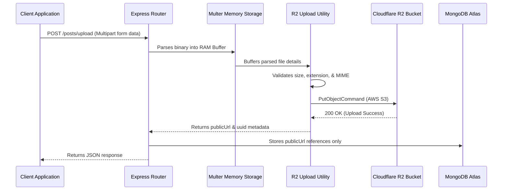

# Backend Documentation Report

This document provides a comprehensive technical guide to the architecture, integrations, authentication model, upload pipelines, and request life cycles of the **Student OS** and **Campus OS** backend service.

---

## 🚀 Technology Stack

- **Runtime Environment**: Node.js (CommonJS, type: module/commonjs)
- **Framework**: Express.js
- **Database Layer**: MongoDB Atlas cluster with Mongoose ODM
- **Object Storage**: Cloudflare R2 Object Storage (AWS S3 SDK compatibility layer)
- **Web Sockets**: Socket.IO for real-time messaging, storytelling view counts, and alerts
- **Push Notification Service**: Firebase Admin SDK (FCM API)
- **Mail Server**: Resend & NodeMailer
- **AI Core**: Google Gemini API (`@google/generative-ai`)

---

## 🔒 Security & Authentication

### 1. Token Lifecycle (JWT)
Authentication utilizes a secure dual-token strategy:
* **Access Tokens**: Short-lived (15 minutes or 30 days depending on client configuration), signed with `JWT_SECRET`. Carries user payload: user ID, role, department, and collegeCode.
* **Refresh Tokens**: Long-lived (90 days), saved inside MongoDB (`RefreshTokens` collection) to enable secure background sessions extension.
* **Rate Limiting**: Configured at `/api/auth` routes using `express-rate-limit` (30 requests per 15 minutes window) to mitigate DDoS/brute-force attacks.

### 2. Role-Based Access Control (RBAC)
Routes are protected using role gates:
* Roles defined inside `User` schema: `student`, `faculty`, `hod`, `coe`, `exam`, `accounts`, `hr`, `admissions`, `super_admin`, `parent`, `recruiter`.
* Middleware guards check role matching before allowing access to domain routes (e.g. principal actions restricted to `principal`).

---

## 📤 Cloudflare R2 Upload Architecture

We have fully migrated from Cloudinary to **Cloudflare R2 Object Storage**. 

### 1. Request Lifecycle (Multer Memory Buffering)


### 2. File Validation rules
* **Executable Blocklist**: Uploading files with `.exe`, `.bat`, `.cmd`, `.sh`, `.vbs`, `.bin` extensions is blocked.
* **Size Enforcement**: Max 5MB for profile avatars; max 10MB for posts and study material attachments.
* **UUID Key Mapping**: Keys are sanitized and hashed into a random UUID name while preserving original extensions to prevent folder traversal or name conflicts:
  * Format: `posts/550e8400-e29b-41d4-a716-446655440000.jpg`

### 3. Cascade Removal cleanups
* When a post or profile image is replaced, the backend triggers `deleteFromR2` to remove the old URL path from the bucket, preventing data leaks or orphan files.

---

## ⚡ WebSocket & Socket.io Events

* **`connection`**: Triggered when client establishes connection.
* **`profile_updated`**: Broadcasts profile changes to active sockets.
* **`post_deleted`**: Broadcasts post IDs to remove deleted feed items instantly.
* **`post_updated`**: Broadcasts modified post contents.
* **`notification`**: Delivers high-priority real-time alerts.

---

## ⚙️ Middleware flow

```text
Request (HTTP)
   │
   ▼
[ Helmet & Security Headers ]
   │
   ▼
[ CORS Policy ]
   │
   ▼
[ Express Body Parser / JSON ]
   │
   ▼
[ Rate Limiter ] (Auth routes only)
   │
   ▼
[ Auth Guard: Protect Middleware ] (Parses JWT Bearer)
   │
   ▼
[ Role Validator Middleware ] (Checks Role permissions)
   │
   ▼
[ Controller Business Logic ] (Handles operations & DB)
   │
   ▼
Response / Error Handler
```
